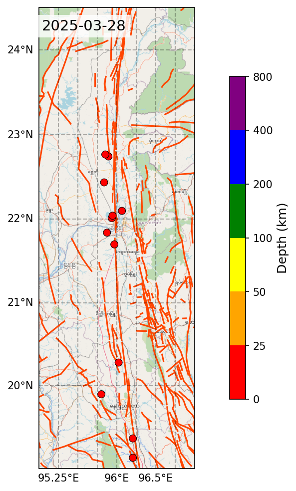

# Myanmar Earthquake Animation: Sagaing Fault Zone (2025-2026)

An animated visualization of earthquake activity along Myanmar's Sagaing Fault Zone following the devastating M7.7 Mandalay earthquake on March 28, 2025. The animation maps 38 significant earthquakes (M4.5+) recorded between March 28, 2025 and January 15, 2026, showing how seismic activity evolved from the initial mainshock through the ongoing aftershock sequence.



## Background

On March 28, 2025, a magnitude 7.7 earthquake struck near Mandalay, Myanmar, along the Sagaing Fault -- a major right-lateral strike-slip fault that runs approximately 1,400 km through the center of Myanmar. The earthquake caused widespread destruction and triggered a prolonged aftershock sequence along the fault zone.

The Sagaing Fault accommodates the relative motion between the India-Burma plate and the Sunda plate, with a slip rate of approximately 18-23 mm/year. It is one of the most seismically active fault systems in Southeast Asia.

This project creates a day-by-day animated visualization of the earthquake sequence, allowing viewers to observe the spatial and temporal patterns of seismic activity as the aftershock sequence progresses.

## Data Sources

| Source | Description | URL |
|--------|-------------|-----|
| **USGS Earthquake Catalog** | Earthquake event data (GeoJSON) | https://earthquake.usgs.gov/earthquakes/search/ |
| **OpenStreetMap** | Base map tiles | https://www.openstreetmap.org/ |
| **Myanmar Tectonic Map (2011)** | Tectonic fault lineaments (GeoJSON) | [GitHub - Myanmar Tectonic Map](https://raw.githubusercontent.com/drtinkooo/myanmar-earthquake/main/Myanmar_Tectonic_Map_2011.geojson) |
| **Natural Earth** | International boundary lines (10m resolution) | https://www.naturalearthdata.com/ |

### USGS Query Parameters

The earthquake data was downloaded from the USGS Earthquake Catalog API with the following parameters:

| Parameter | Value |
|-----------|-------|
| Start Date | 2025-03-28 |
| End Date | 2026-03-14 |
| Min Magnitude | 4.5 |
| Min Latitude | 19.0 |
| Max Latitude | 24.5 |
| Min Longitude | 95.0 |
| Max Longitude | 97.0 |
| Format | GeoJSON |
| Order By | time-asc |

### Dataset Summary

- **38 earthquakes** recorded within the Sagaing Fault Zone bounding box
- **Magnitude range:** 4.5 -- 7.7
- **Depth range:** 4.5 -- 10.0 km (predominantly shallow crustal events)
- **Temporal span:** March 28, 2025 -- January 15, 2026

| Month | Events |
|-------|--------|
| 2025-03 | 15 |
| 2025-04 | 10 |
| 2025-05 | 2 |
| 2025-07 | 3 |
| 2025-08 | 2 |
| 2025-09 | 2 |
| 2025-12 | 2 |
| 2026-01 | 2 |

## Methodology

### Map Construction

The visualization uses a multi-layered map centered on the Sagaing Fault Zone (95.0-97.0E, 19.0-24.5N):

1. **Base layer:** OpenStreetMap tiles at zoom level 8 provide geographic context (roads, cities, terrain).
2. **Tectonic overlay:** Fault lineaments from the Myanmar Tectonic Map (2011) are drawn in orange-red to show the structural geology.
3. **Political boundaries:** International borders from Natural Earth (10m resolution) are drawn as dotted black lines.

### Earthquake Visualization

Each earthquake is plotted as a circle at its epicenter location. The visualization encodes two dimensions of data:

- **Color** represents hypocentral depth, using a discrete colormap:

  | Depth (km) | Color |
  |------------|-------|
  | 0 -- 25 | Red |
  | 25 -- 50 | Orange |
  | 50 -- 100 | Yellow |
  | 100 -- 200 | Green |
  | 200 -- 400 | Blue |
  | 400 -- 800 | Purple |

- **Transparency (alpha)** represents event recency using a 7-day sliding window. On each frame, all earthquakes from the current day and the previous 6 days are displayed. The newest events appear fully opaque, while older events progressively fade out, creating a visual "tail" that shows recent seismic migration.

### Animation Assembly

- One PNG frame is generated for each calendar day in the dataset (294 frames total).
- Each frame includes a date stamp in the upper-left corner.
- Frames are compiled into an MP4 video at 10 frames per second, producing a ~29-second animation.

## Project Structure

```
.
├── README.md                    # This file
├── animation_MDYquakes.ipynb    # Main Jupyter notebook (data processing + animation)
├── query.json                   # Raw earthquake data from USGS (GeoJSON)
├── Quakes_filtered.xyzt         # Processed earthquake data (lon lat depth time)
├── frames/                      # Generated PNG frames (one per day)
│   ├── frame_000.png
│   ├── frame_001.png
│   └── ...
└── Myanmar_Animation_2025_2026.mp4  # Final output video
```

### File Descriptions

| File | Description |
|------|-------------|
| `animation_MDYquakes.ipynb` | Jupyter notebook containing all code. Cell 1 installs dependencies. Cell 2 converts the USGS GeoJSON to a simplified `.xyzt` text format. Cell 3 builds the map, generates animation frames, and assembles the final video. |
| `query.json` | Raw GeoJSON data downloaded from the USGS Earthquake Catalog API. Contains full event metadata including magnitude, location, depth, time, and source information. |
| `Quakes_filtered.xyzt` | Simplified text file with one earthquake per line in the format: `longitude latitude depth(km) timestamp`. This is the direct input to the animation script. |
| `frames/` | Directory containing 294 PNG images, one for each day from 2025-03-28 to 2026-01-15. |
| `Myanmar_Animation_2025_2026.mp4` | Final animated video (MP4, 10 fps). |

## Workflow

The end-to-end workflow consists of six steps. Steps 1-5 are executed by the Jupyter notebook.

### Step 1: Data Acquisition

Download earthquake data from the [USGS Earthquake Catalog](https://earthquake.usgs.gov/earthquakes/search/):

1. Navigate to the USGS Earthquake Catalog search page.
2. Set the date range, geographic bounding box (Sagaing Fault Zone), and minimum magnitude.
3. Select **GeoJSON** as the output format.
4. Download the result as `query.json`.

Alternatively, use the API directly:

```
https://earthquake.usgs.gov/fdsnws/event/1/query?format=geojson&starttime=2025-03-28&endtime=2026-03-14&minlatitude=19.0&maxlatitude=24.5&minlongitude=95.0&maxlongitude=97.0&minmagnitude=4.5&orderby=time-asc
```

### Step 2: Data Preparation

The notebook reads `query.json` and extracts four fields from each earthquake feature:

- **Longitude** and **Latitude** (epicenter location)
- **Depth** (hypocentral depth in km)
- **Time** (converted from Unix milliseconds to `YYYY-MM-DDTHH:MM:SS` format)

The output is written to `Quakes_filtered.xyzt`, a space-delimited text file.

### Step 3: Map Construction

The script builds the static map canvas using Cartopy:

1. Fetches OpenStreetMap tiles for the Sagaing Fault Zone region.
2. Overlays tectonic fault lineaments from the Myanmar Tectonic Map GeoJSON.
3. Adds international borders and coordinate gridlines.
4. Creates a depth color bar legend.

This step requires an internet connection to fetch map tiles and the tectonic GeoJSON.

### Step 4: Frame Generation

The script iterates through each calendar day and:

1. Filters earthquakes within a 7-day sliding window.
2. Calculates transparency based on event age (newer = more opaque).
3. Plots earthquake circles color-coded by depth.
4. Adds a date stamp and saves the frame as a PNG.

### Step 5: Video Assembly

All PNG frames are read in chronological order and encoded into an MP4 video at 10 fps using ImageIO with the FFmpeg backend.

### Step 6: GIF Conversion (Optional)

The MP4 can be converted to an animated GIF using an online tool such as [ezgif.com](https://ezgif.com/video-to-gif):

1. Upload the MP4 file.
2. Convert to GIF.
3. Optionally reduce the frame rate (e.g., from 10 to 5 fps) to reduce file size.
4. Download the optimized GIF.

## Reproducing the Animation

### Prerequisites

- Python 3.10+
- Internet connection (for OSM tiles and tectonic map data)

### Option A: Run the Jupyter Notebook

1. Clone this repository:

   ```bash
   git clone https://github.com/drtinkooo/myanmar-earthquake.git
   cd myanmar-earthquake
   ```

2. Install dependencies:

   ```bash
   pip install cartopy imageio imageio-ffmpeg geopandas pandas matplotlib tqdm
   ```

3. Open and run all cells in `animation_MDYquakes.ipynb`.

4. The output video will be saved as `Myanmar_Animation_2025_2026.mp4`.

### Option B: Run in Google Colab

1. Upload `animation_MDYquakes.ipynb` to [Google Colab](https://colab.research.google.com/).
2. Upload `query.json` to the Colab runtime files.
3. Run all cells. The first cell installs the required packages.
4. Download the generated `Myanmar_Animation_2025_2026.mp4` from the runtime files.

### Updating the Data

To extend the animation with newer earthquake data:

1. Visit the [USGS Earthquake Catalog](https://earthquake.usgs.gov/earthquakes/search/) or use the API URL above, adjusting the `endtime` parameter to the desired date.
2. Download the new `query.json` and replace the existing file.
3. Re-run all cells in the notebook. The animation will automatically adjust its date range to match the new data.

### Customizing the Bounding Box

To visualize a different region, modify the bounding box constants in Cell 3 of the notebook:

```python
# Sagaing Fault Zone bounding box
MIN_LON, MAX_LON = 95.0, 97.0
MIN_LAT, MAX_LAT = 19.0, 24.5
```

Ensure the USGS query parameters match the new bounding box.

## Dependencies

| Package | Purpose |
|---------|---------|
| `cartopy` | Map projections, tile fetching, and geographic feature rendering |
| `matplotlib` | Plotting and figure generation |
| `pandas` | Tabular data loading and time-series operations |
| `geopandas` | Reading and rendering GeoJSON tectonic lineament data |
| `imageio` | Reading PNG frames and writing MP4 video |
| `imageio-ffmpeg` | FFmpeg backend for video encoding |
| `tqdm` | Progress bars for frame generation and video assembly |

## License

This project is intended for educational and research purposes. Earthquake data is provided by the [USGS Earthquake Hazards Program](https://earthquake.usgs.gov/) and is in the public domain. Map tiles are provided by [OpenStreetMap](https://www.openstreetmap.org/copyright) contributors under the ODbL license.

## Acknowledgments

- **USGS Earthquake Hazards Program** for providing open access to global earthquake catalog data.
- **OpenStreetMap contributors** for the base map tiles.
- **Myanmar Geosciences Society** for the Myanmar Tectonic Map (2011) used as the fault lineament overlay.
